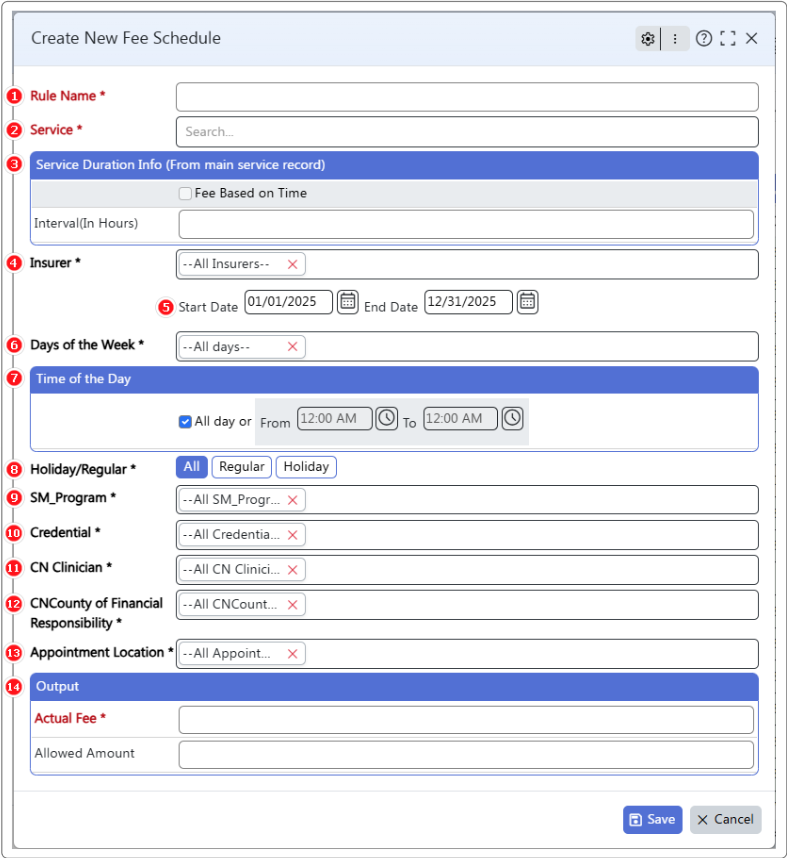

# Configure-Fee-Schedule

### Overview
The **Configure Fee Schedule** module allows you to create and manage **payor-specific fee schedules** that determine how much an insurance plan reimburses for each covered service. This ensures accurate billing aligned with contract terms, helps manage exceptions, and tracks both **Actual Fees** and **Allowed Amounts**.

**Permissions Required:**  
The staff member must have full access to the BillingTracker module.  
Navigate to: **Staff > Staff Info > System Permissions > BillingTracker Access**

### Getting Started
Use this module to define rules for payors that specify the maximum amount an insurance company will pay for specific medical services. Follow the steps below to create a new fee schedule.

1. **Rule Name:** Enter a descriptive name (e.g., “Service Payment Rates by Insurance Plan”).  
2. **Service:** Select the service from the list.  
3. **Service Duration Info:** Automatically populated from *Maintenance Forms > Service Input.*  
4. **Insurer:** Select one, multiple, or all insurers to which the fee schedule applies.  
5. **Start and End Date:** Define the active period for the rule.  
6. **Days of the Week:** Choose the applicable days for this rule.  
7. **Time of the Day:** Specify the time period or select “All Day.”  
8. **Holiday/Regular:** Choose if the rule applies to Holidays, Non-Holidays, or both.  
9. **Program:** Select the program(s) this fee applies to.  
10. **Credential:** Specify provider credentials for which the schedule is valid.  
11. **Clinician:** Select the clinician(s) for the rule.  
12. **County of Financial Responsibility:** Choose the applicable county.  
13. **Appointment Location:** Select the place of service or choose “All Locations.”  
14. **Output:** Select the appropriate fee structure for the service.  
**Actual Fee:** The fee billed on the claim.  
**Allowed Amount:** The maximum reimbursement limit defined by the insurer.

---

### FAQs

**[Q] What is the difference between Actual Fee and Allowed Amount?**  
**[A]** The Actual Fee is the provider’s billed charge, while the Allowed Amount is the insurer’s reimbursement limit. The difference may be adjusted as per contract terms.

**[Q] If I configure a fee schedule with a future start date, will it affect current billing?**  
**[A]** No. Future-dated fee schedules activate only on their start date and do not impact current billing.

**[Q] When fees change, should I edit the existing fee schedule or create a new one?**  
**[A]** Create a new fee schedule with updated rates and a new date range. This preserves historical data while applying new rates moving forward.

**[Q] Can I assign fee schedules to individual providers?**  
**[A]** Yes. You can configure fee schedules for specific staff members, allowing flexibility for providers with different rates.

**[Q] Can I temporarily disable a fee schedule rule?**  
**[A]** Yes. Set an *End Date* to automatically deactivate the rule.

